# Kyndryl GreenSpark Hackathon: EcoVision (1st place)

  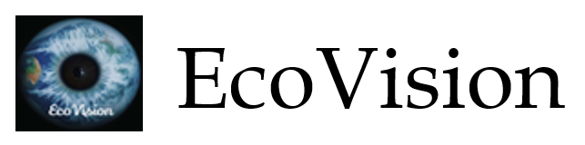
&nbsp; &nbsp; &nbsp; &nbsp;
  

<h3 align="center">Reduce Carbon Footprint in every Software Development Life-Cycle</h3>

  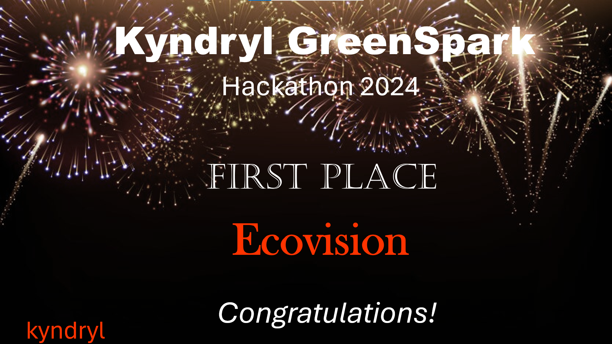
&nbsp; &nbsp; &nbsp; &nbsp;

<h2>Team Members</h2>

- Cloud Architect: Praveen Kumar Madhava Rao 
- Enterprise Architect: Pedro Soares
- Software Architect: Kavitha Suresh Kumar
- Software Engineer: Kannika Kabilar
- Software Engineer: Kavya Singh
- Project Management: Adrianna Kocyba-Kostecka
- DevOps Specialist: Iwona Kwiek
- UX Designer: Chandan Bhat
- UX Designer: BhavyaShree Mucherla
- Technical Associate: Dominika Fargasova

 

<h3>Group Picture of Ecovision Members and Hackathon Mentors</h3>

  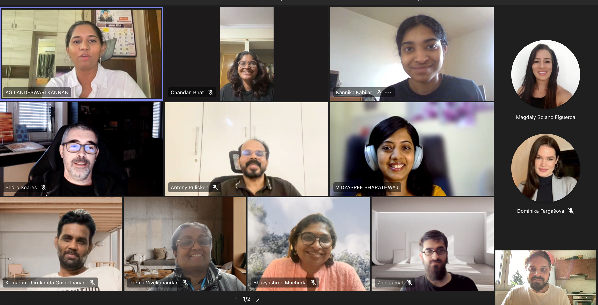
&nbsp; &nbsp; &nbsp; &nbsp;

 

<h2>Developer's Interface</h2>

[]

  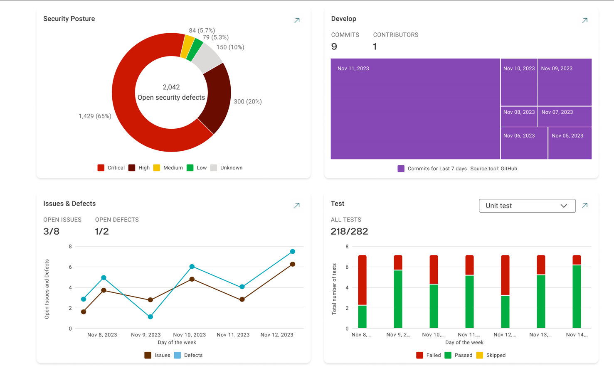
&nbsp; &nbsp; &nbsp; &nbsp;

<h2>Application Dashboard</h2>

[]

  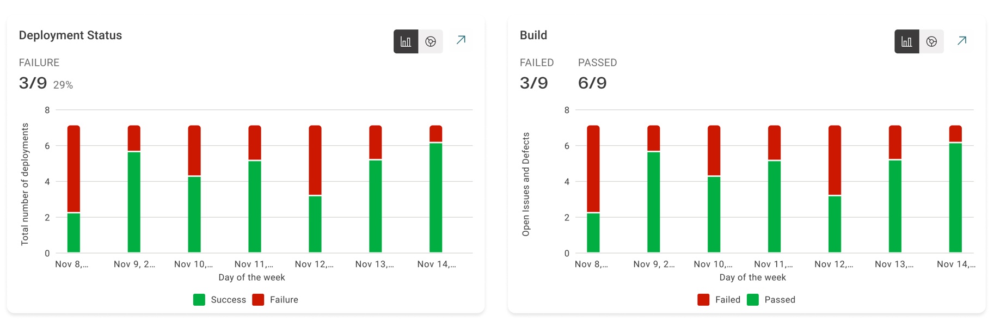
&nbsp; &nbsp; &nbsp; &nbsp;
  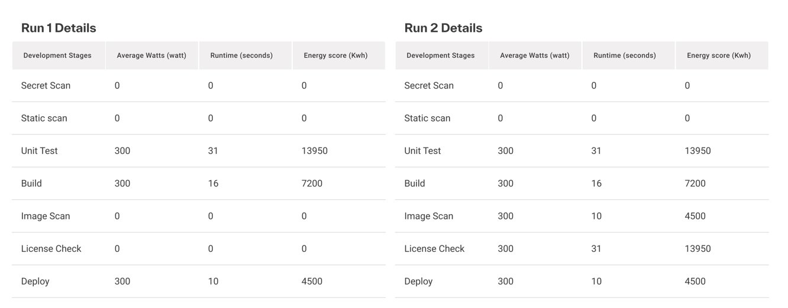

 
<h2>Hackathon Theme</h2>

Create a solution to measure the carbon footprint of the software we are building to enable developers to write more efficient code.  This capability can be easily integrated into the CI/CD pipeline to continuously measure and reduce the environmental impact of our code. 

<h2>Overiew of the Solution Approach</h2>

•	EcoVision adopts an innovative approach to address the pressing issue of reducing the carbon footprint in software development processes.  
•	Our strategy revolves around harnessing advanced technologies such as dynamic runtime analysis, machine learning algorithms (specifically RandomForest), and automation to offer real-time monitoring and optimization of code's environmental impact.  
•	By seamlessly integrating into the CI/CD pipeline, EcoVision empowers developers to assess the environmental implications of their code changes promptly.  
•	This approach not only promotes environmental sustainability but also ensures software quality and delivery efficiency.  
•	Furthermore, EcoVision incorporates a performance indicator that quantifies the environmental impact of each code change suggested by the optimization engine.  
•	The percentage change in the performance indicator is captured and visualized using a Business Intelligence (BI) tool, enabling stakeholders to track the effectiveness of optimization efforts over time.  
•	This iterative feedback loop ensures continuous improvement in environmental sustainability while providing actionable insights to drive further optimization initiatives.  
•	Moreover, EcoVision leverages its integration with BI tools to provide comprehensive visualizations of environmental metrics, allowing stakeholders to gain insights into the environmental impact of software development activities across the organization.  
•	This visibility fosters transparency and accountability, enabling informed decision-making and driving a culture of environmental responsibility within the organization.  
•	Overall, EcoVision's approach combines advanced technology, automation, and data visualization to deliver a comprehensive solution for reducing the carbon footprint of software development processes.  
•	By providing real-time insights and actionable recommendations, EcoVision empowers organizations to prioritize environmental sustainability while optimizing software delivery and performance.  

<h2>Proposed Value to the Customer</h2>

The proposed value of EcoVision to the customer is multi-faceted and impactful.   
•	Firstly, it enables organizations to align their software development practices with environmental sustainability goals, thereby enhancing their corporate social responsibility (CSR) initiatives and improving brand reputation.  
•	By providing real-time monitoring and optimization of code's environmental impact, EcoVision helps customers reduce their carbon footprint and contribute to mitigating climate change.  
•	Additionally, EcoVision drives operational efficiency by streamlining the software development process, optimizing resource usage, and reducing energy consumption. This results in cost savings and improved resource allocation, ultimately enhancing the organization's bottom line.  
•	Moreover, EcoVision fosters innovation by promoting a culture of environmental responsibility and encouraging the adoption of sustainable practices across the organization.  
•	Through actionable insights and continuous optimization, EcoVision empowers customers to lead the way in sustainable software development and environmental stewardship.

<h2>Innovation and Novelty in EcoVision</h2>

EcoVision introduces several innovative approaches and novel features to revolutionize the way organizations address the environmental impact of software development:   
•	Dynamic Runtime Analysis: Unlike traditional static analysis tools, EcoVision utilizes dynamic runtime analysis to capture real-time data on code execution and resource usage. This approach provides a more accurate assessment of the environmental impact of code changes and enables developers to make informed decisions based on real-world performance metrics.  
•	Machine Learning Optimization Engine: EcoVision incorporates a machine learning optimization engine, specifically leveraging RandomForest regression, to analyze patterns in code execution data and identify areas for optimization. By continuously learning from historical data and feedback, the optimization engine suggests actionable recommendations to developers for reducing carbon emissions and improving efficiency.  
•	Seamless CI/CD Integration: EcoVision seamlessly integrates into the CI/CD pipeline, automating the process of environmental impact assessment and optimization. This integration ensures that sustainability considerations are embedded into the software development workflow without disrupting productivity, enabling organizations to achieve environmental goals without compromising on speed or quality.  
•	Multi-Domain Expertise: EcoVision draws expertise from multiple domains, including software development, environmental sustainability, data analytics, and automation. This interdisciplinary approach ensures a comprehensive and effective solution to the problem of reducing the carbon footprint of software development, addressing the needs of diverse stakeholders and driving innovation across the organization.  
•	Visual Analytics and BI Integration: EcoVision incorporates visual analytics and business intelligence (BI) tools to provide stakeholders with intuitive dashboards and reports. These tools enable organizations to track key performance indicators related to environmental sustainability, visualize trends over time, and make data-driven decisions to optimize their software development processes further.    
Overall, EcoVision represents a groundbreaking solution that leverages advanced technologies and interdisciplinary expertise to drive sustainable innovation in software development. By introducing novel approaches to environmental impact assessment and optimization, EcoVision empowers organizations to achieve their sustainability goals while delivering value to customers and stakeholders.  

<h2>Hackathon Rounds & Results</h2>

<h3>Round 1</h3>

  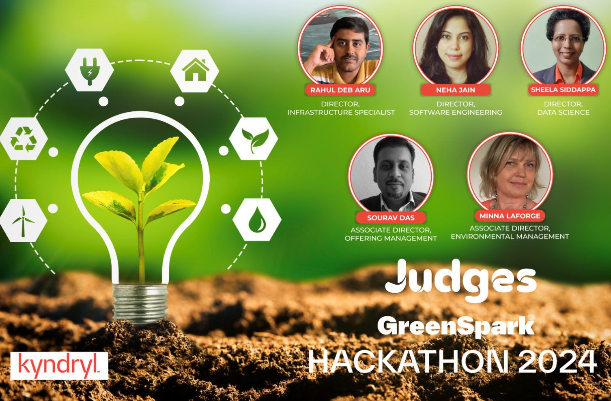
&nbsp; &nbsp; &nbsp; &nbsp;
  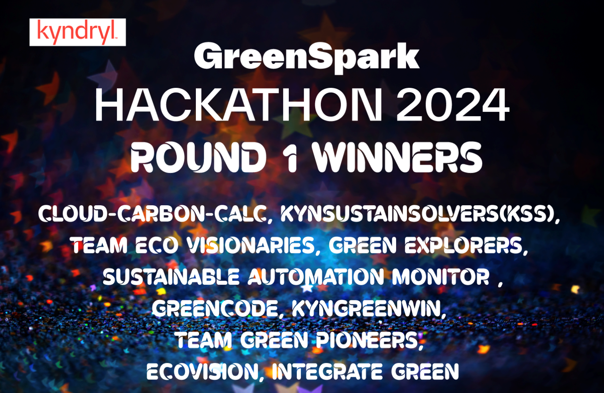

<h3>Round 2</h3>

  
&nbsp; &nbsp; &nbsp; &nbsp;
  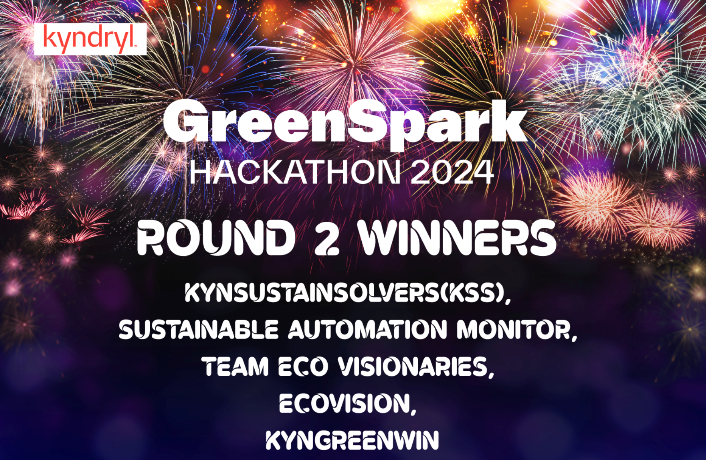

<h3>Round 3</h3>

  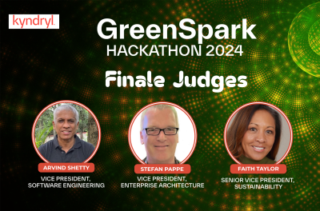
&nbsp; &nbsp; &nbsp; &nbsp;
  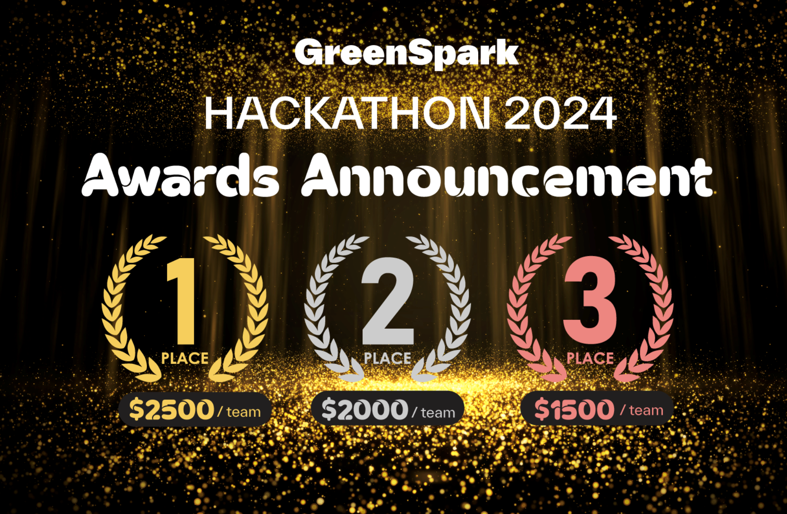

<h3>Finale Results</h3>

  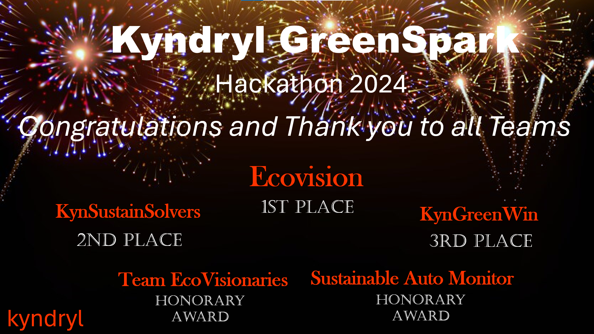
&nbsp; &nbsp; &nbsp; &nbsp;

